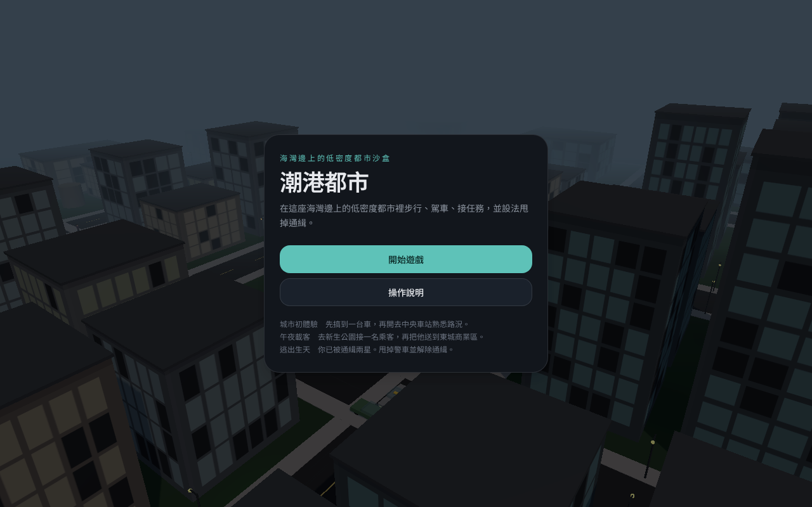
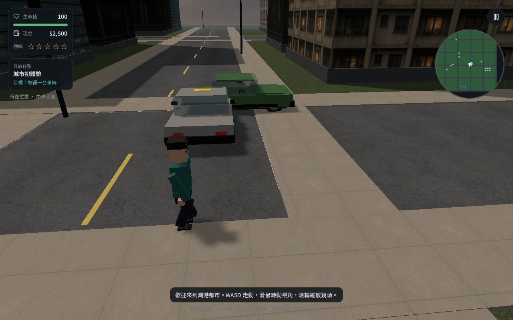
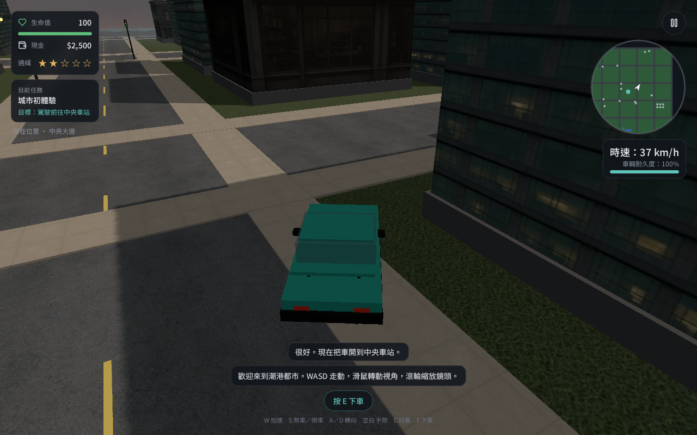

# 潮港都市

**Chao Gang City** — 瀏覽器裡的 3D 開放世界都市沙盒。

步行、找車、駕駛、接任務，並在通緝等級升高後甩掉警車。全程繁體中文介面，無需帳號即可遊玩。

[](LICENSE)
[](https://www.typescriptlang.org/)
[](https://threejs.org/)
[](https://react.dev/)

<p align="center">
  
</p>

<p align="center">
  
  
</p>

---

## 遊戲特色

- **第三人稱沙盒**：WASD 步行與駕駛、滑鼠視角、空白鍵跳躍／手煞、`E` 互動、`F` 交談
- **車輛系統**：加速、煞車、倒車、轉向、手煞側滑、車體傾側、耐久度與時速 HUD
- **通緝 0–5 星**：嚴重車禍或衝撞路人會引來警車；拉開距離並躲藏即可解除
- **市民 NPC**：姓名、職業、個性與模組化對白，之後可接 LLM
- **三則任務**：城市初體驗 → 午夜載客 → 逃出生天
- **原創地圖**：中央大道、海灣區、新生公園、東城商業區、西港工業區、中央車站、城南警察局
- **黃昏街景**：建築立面、路面、草地與天空使用貼圖；車輛與行人由幾何組裝

> 本作為原創都市沙盒，地圖、角色與系統皆為獨立設計。

## 操作

| 按鍵 | 步行 | 駕車 |
| --- | --- | --- |
| `W` `A` `S` `D` | 移動 | 加速／轉向／煞車與倒車 |
| 滑鼠拖曳或鎖定游標 | 轉動鏡頭 | 微調鏡頭，鬆開後回正車尾 |
| `Shift` | 跑步 | — |
| 空白鍵 | 跳躍 | 手煞車 |
| `C` | 向後看 | 向後看 |
| 滾輪 | 拉近／拉遠 | 拉近／拉遠 |
| `E` | 上車、商店 | 下車、接乘客 |
| `F` | 與市民交談 | — |
| `Esc` | 暫停 | 暫停 |

觸控裝置有虛擬搖桿、視角區與互動鈕。

## 任務

| 任務 | 內容 | 獎勵 |
| --- | --- | --- |
| **城市初體驗** | 取得車輛，開到中央車站 | $1,500 |
| **午夜載客** | 到新生公園接乘客，送往東城商業區 | $3,200 |
| **逃出生天** | 在兩星通緝下甩掉警車並解除通緝 | $5,000 |

完成後城市仍可自由探索。

## 地圖

- 中央大道
- 海灣區
- 新生公園
- 東城商業區／東城便利商店
- 西港工業區
- 中央車站
- 城南警察局
- 港灣停車場

## 技術棧

| 層 | 技術 |
| --- | --- |
| 應用殼 | TanStack Start、React 19、Tailwind CSS v4 |
| 3D 引擎 | 原生 Three.js（固定步進 1/60，非 R3F） |
| 狀態 | Zustand HUD |
| 碰撞 | 自製圓形／AABB |
| 輸入 | 鍵盤、滑鼠鎖定、手把、觸控 |

遊戲邏輯集中在 [`src/game/`](src/game/)：

```
src/game/
  engine.ts      主迴圈、鏡頭、通緝、任務
  city.ts        街區、道路、建築、碰撞體
  meshes.ts      車輛、行人、路燈與場景道具
  textures.ts    立面／地面／天空貼圖
  input.ts       WASD、手煞、回看、滾輪縮放
  dialogue.ts    對白提供者（腳本／可換 LLM）
  data.ts        地名、NPC、任務、介面字串（zh-TW）
```

## 快速開始

需要 **Node.js 22** 與 npm。

```bash
git clone https://github.com/richie7p/chao-gang-city.git
cd chao-gang-city
npm install
npm run dev
```

瀏覽器開啟 [http://127.0.0.1:8080](http://127.0.0.1:8080) 即可遊玩。

建議流程：點「開始遊戲」→ 中央大道路邊藍綠色跑車按 `E` 上車 → 繞城一圈 → 試手煞過彎與通緝追逐。

### 其他指令

```bash
npm run typecheck   # TypeScript
npm run build       # 正式建置
npm run preview     # 預覽建置結果
```

本專案不需資料庫或登入即可執行。

## 授權

MIT License。詳見 [LICENSE](LICENSE)。
